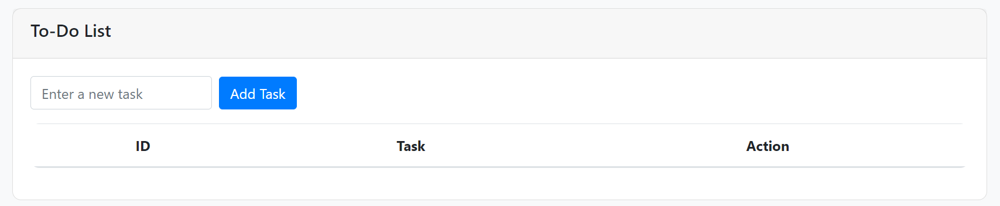
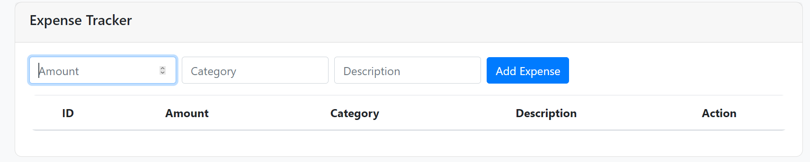

# To-Do List and Expense Tracker

This project is a web application that allows users to manage their tasks and track their expenses. It features a modern, dark-themed user interface built with Flask for the backend and Tailwind CSS along with Bootstrap for styling.

## Features

- **To-Do List**:
  - Add and delete tasks.
  - Mark tasks as completed.
  - Display tasks in a user-friendly table.

- **Expense Tracker**:
  - Add and delete expenses.
  - Track expenses by category and description.
  - Automatically calculates and displays the total expenses.

- **Responsive Design**:
  - Built with Tailwind CSS and Bootstrap for a modern, responsive layout.
  
## Requirements

- Python 3.x
- Flask
- SQLite 

## Screenshots

### To-Do List Interface

### Expense Tracker Interface

